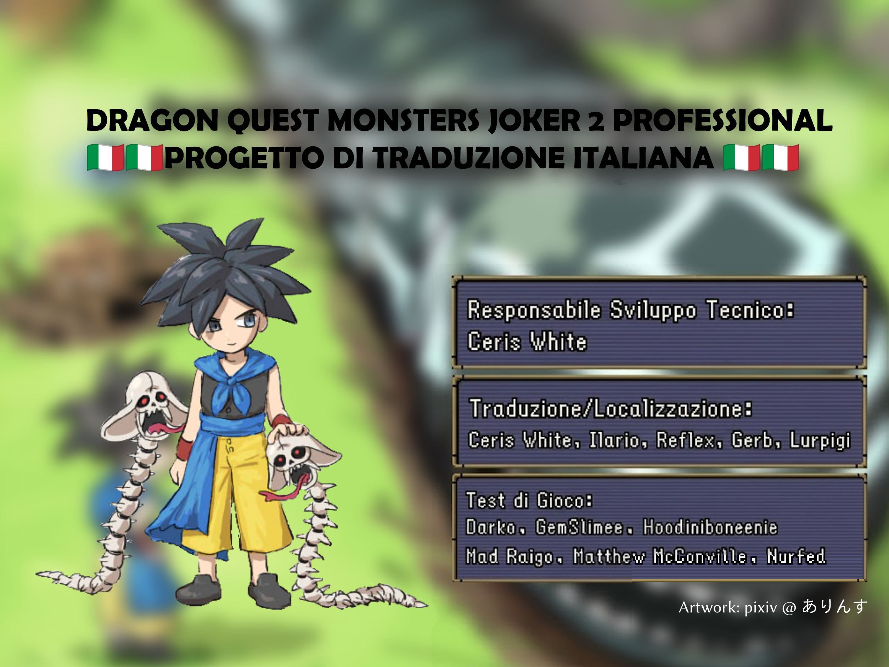

# Dragon Quest Monsters: Joker 2 Professional – Traduzione italiana

Questa sezione documenta la traduzione amatoriale italiana di **Dragon Quest Monsters: Joker 2 Professional**.

## Metodo di traduzione

La traduzione è stata realizzata partendo dai testi inglesi già presenti nella versione Professional e verificando ogni voce, quando possibile, contro i testi originali e le lingue interne della versione normale di DQMJ2.

In particolare:

- i dialoghi, i menu, le descrizioni e i nomi già presenti nella versione normale sono stati confrontati con la relativa traduzione italiana ufficiale;
- la versione italiana ufficiale di DQMJ2 è stata privilegiata per nomi di mostri, mosse, abilità, tratti, oggetti, luoghi, personaggi e formule ricorrenti;
- i contenuti aggiunti o modificati in Professional, assenti nella versione normale, sono stati tradotti manualmente mantenendo il tono, lo stile e la terminologia già usati nel gioco;
- la legenda della [traduzione italiana di DQMJ3P](https://github.com/Lurpigi/DQMJ3P-IT-FanTranslation) è stata usata solo come riferimento secondario per termini del franchise non presenti in DQMJ2, soprattutto per mostri, mosse e abilità. Non è stata usata per importare luoghi o nomi specifici di DQMJ3P;
- i riferimenti nei dialoghi sono stati controllati anche nei comandi `SAY` e `SETNAME`, inclusi i nomi parziali inseriti tramite codici del gioco.

I codici di controllo, i segnaposto (`{NAME}`, `{E321}`, `{COLOR=...}`, `{WAIT}`, `{BREAK}` e simili) e i caratteri compressi del formato originale vengono mantenuti perché sono necessari al corretto funzionamento dei testi in gioco. Per questo motivo alcuni frammenti apparentemente insoliti non sono errori di traduzione, ma codici che il gioco espande durante la visualizzazione.

## Struttura dei file di traduzione

- `Translation/SCRIPTS/`: dialoghi della storia, eventi, tutorial e contenuti post-game estratti in formato leggibile. I comandi dello script sono lasciati intatti e vengono tradotte le stringhe contenute in `SAY` e i nomi in `SETNAME`.
- `Translation/STRINGS/`: testi dell'interfaccia e delle tabelle di gioco, inclusi nomi di mostri, mosse, abilità, tratti, oggetti, luoghi e personaggi, oltre a descrizioni, messaggi di battaglia e testi delle modalità wireless.
- `game/rom/`: dati estratti dalla versione normale di DQMJ2, usati per il confronto con l'italiano ufficiale.
- `game/romP/`: dati estratti dalla versione Professional, usati per individuare le aggiunte e le differenze da tradurre; contiene testo misto inglese/giapponese e non viene usata automaticamente come sorgente italiana.
- `Pro_Tools/`: strumenti per estrarre, modificare, ricostruire e verificare gli script e i file di testo della ROM, tra cui `msgtool.py` e `storytool.py`.
- `game/tmp/`: script temporanei di analisi, confronto, normalizzazione e controllo. `import_legend_terms.py` importa solo corrispondenze esatte dalla legenda italiana di DQMJ3P, escludendo intenzionalmente i luoghi; `make_italian_databases.py` genera le copie italiane dei database. Questi script servono a rendere ripetibili le verifiche e non sono necessari al funzionamento della ROM patchata.
- `Guide/`: guide per estrazione, applicazione della patch, patch anti-pirateria, Linux e aggiunta di contenuti.

## Database di terminologia

I seguenti CSV sono stati aggiunti nella cartella `Database/` per documentare la terminologia usata nella traduzione. Le colonne principali sono `id`, `english` e `italian`; gli ID permettono di risalire alla voce corrispondente nelle tabelle del gioco.

- [`translation_monsters.csv`](Database/translation_monsters.csv): nomi dei mostri.
- [`translation_moves.csv`](Database/translation_moves.csv): nomi delle mosse e delle azioni di battaglia.
- [`translation_skills.csv`](Database/translation_skills.csv): nomi delle abilità e degli alberi di abilità.
- [`translation_traits.csv`](Database/translation_traits.csv): nomi dei tratti e delle caratteristiche speciali.
- [`translation_items.csv`](Database/translation_items.csv): nomi degli oggetti.
- [`translation_places.csv`](Database/translation_places.csv): luoghi, aree e destinazioni.
- [`translation_npcs.csv`](Database/translation_npcs.csv): personaggi e nomi usati dagli script.
- [`translation_names_all.csv`](Database/translation_names_all.csv): raccolta complessiva delle categorie precedenti, utile per ricerche rapide e controlli di coerenza.

Questi file non vengono importati direttamente nella ROM: sono una documentazione di supporto e un riferimento per mantenere coerenti i nomi nelle descrizioni e nei dialoghi. Ad esempio, un oggetto che contiene il nome di un mostro deve usare esattamente il nome italiano del mostro presente nel database.

### Database in italiano

Sono state aggiunte anche copie italiane dei database di gioco. I database inglesi originali sono stati mantenuti; le copie con suffisso `_it` sono pensate per consultare più facilmente statistiche, resistenze e ricette usando la terminologia italiana del progetto.

- [`monster_database_it.csv`](Database/monster_database_it.csv): statistiche, grado, famiglia, abilità e tratti dei mostri.
- [`monster_resistance_database_it.csv`](Database/monster_resistance_database_it.csv): resistenze dei mostri con intestazioni e nomi italiani.
- [`synthesis_database_it.html`](Database/synthesis_database_it.html): database delle ricette con ricerca nel browser.
- [`synthesis_database_it.csv`](Database/synthesis_database_it.csv): stessa raccolta delle ricette in formato CSV.
- [`monster_ids_it.csv`](Database/monster_ids_it.csv): corrispondenza tra ID e nomi italiani dei mostri.
- [`new_synths_4g_it.csv`](Database/new_synths_4g_it.csv) e [`new_synths_kind_it.csv`](Database/new_synths_kind_it.csv): ricette aggiuntive con nomi italiani e ID dei mostri.
- [`postgame_pipit_vendor_items_it.csv`](Database/postgame_pipit_vendor_items_it.csv): oggetti venduti dal mercante Pipit nel post-game.

Le copie italiane sono generate a partire dai database originali e dalle tabelle ufficiali inglese→italiano già presenti nel progetto; non sostituiscono i file usati dagli strumenti di gioco o dal randomizer.

## Note e limiti

La traduzione è stata controllata sui file estratti e sugli script ricostruiti. Dovrò ancora testarla interamente nel gioco. Alcune grafiche con testo giapponese possono inoltre rimanere non tradotte.

Per applicare la traduzione usare il patcher o le guide presenti nel repository e una ROM ottenuta legalmente. Questo repository non fornisce ROM commerciali.

## Funzionalità

- Menu di gioco, dialoghi della storia e contenuti post-game sono stati tradotti e localizzati in italiano, basandosi soprattutto sui testi originali e sulla traduzione italiana ufficiale della versione normale di DQMJ2.
- Sono state aggiunte nuove ricette di sintesi per mostri presenti nei file di gioco ma non ottenibili normalmente, ad esempio mostri esclusivi del Wi-Fi.
- È disponibile un programma con interfaccia grafica per applicare la patch in modo semplice.
- La patch anti-pirateria permette di giocare anche su hardware originale compatibile.
- Sono disponibili modifiche opzionali di qualità della vita e di gameplay.
- Sono stati aggiunti database per ricette di sintesi, tratti, abilità, statistiche e resistenze.
- È incluso un randomizzatore con filtri per grado, famiglia e dimensione, randomizzazione dell'esperienza e opzioni per aumentare la difficoltà.

## Problemi noti

- Alcune grafiche del gioco contenenti testo giapponese possono rimanere non tradotte. A differenza del testo normale, le grafiche richiedono la modifica di asset specifici e non sempre è possibile intervenire in sicurezza.
- Il randomizzatore può causare instabilità nel gioco.
- Per esempio, una battaglia che normalmente affronta tre slime e occupa tre slot nemici può generare tre mostri grandi da tre slot ciascuno, richiedendo nove slot e causando un crash. Per una sessione più stabile, è consigliabile escludere i mostri da tre slot oppure fuggire dagli incontri opzionali problematici.
- Con l'opzione `Randomizza le ricette di sintesi`, alcuni risultati della famiglia `???` potrebbero non essere sintetizzabili e il gioco potrebbe bloccarsi quando vengono visualizzati. Se un risultato non mostra il nome, è consigliabile non selezionarlo né visualizzarlo.
- Se il nome originale di un mostro reclutato supera i 13 caratteri, per esempio Liquid Metal King Slime con 23 caratteri, la tastiera dello schermo inferiore può mostrare un difetto grafico quando si prova a ripristinare il nome predefinito. Il problema è solo visivo e non impedisce di continuare a rinominare il mostro.
- Il firmware originale di alcuni R4 potrebbe non funzionare correttamente con la patch. Consultare la [guida per R4](Guide/playing_on_r4.md) per le informazioni sulla compatibilità.

## Crediti

**Sviluppo tecnico:**

- Ceris White: creazione del toolkit Python usato per modificare la ROM e inserire i testi inglesi.
- Saneezore: creazione dell'interfaccia grafica del patcher.
- Mow: implementazione della patch anti-pirateria per l'overlay 4.
- WireOn: adattamento del suo [randomizzatore di DQMJ2](https://github.com/Wire0n-misc/dqmj2-randomizer) per questo progetto.

**Traduzione e localizzazione:**

- Ceris White, Ilario, Reflex: importazione dei testi inglesi esistenti e traduzione dei menu di gioco.
- Gerb: traduzione e localizzazione dei contenuti post-game.
- GemSlimee, TheTwistery, monkeyboy: revisione e correzione dei testi.

**Nuove ricette di sintesi:**

- Darko, Hoodiniebobeenie, Anthcny: creazione delle nuove ricette e bilanciamento del gioco.

**Test di gioco:**

- Ilario, Reflex, Gerb, Darko, GemSlimee, Hoodinibobeenie, Mad Raigo, Matthew McConville, Nurfed, Chris, diortememirp, Nightaura, Sloppydeck, Anti-Tank Guided Missile, Ghostface, Blark, Tifa'sLover, Samwise, oho.

**Server Discord [Dragon Quest Translations](https://discord.gg/aX6Ac8cC84):**

- Ha ospitato e supportato la collaborazione del progetto.

---

## [V1.0.0 Release Announcement](https://github.com/Saneezore/DQMJ2Pro_Translation/blob/master/Guide/v1.0_announcement_post.md) & [F.A.Q](Guide/faq.md)

This fork of Ceris White's Joker 2 Professional repository includes a completed translation and localisation by the English Translation Project team.

[Patcher Program](https://github.com/Saneezore/DQMJ2Pro_Translation/releases) with friendly user interface for patching your legally obtained rom. Select your rom, check which patch options you want, then run the program. 

Database of Monster [Synthesis](https://saneezore.github.io/DQMJ2Pro_Translation/Database/synthesis_database.html) Recipes. 
(New custom Synthesis Recipes are at the bottom of the list) 
Database of Monster [Stats and Traits](https://github.com/Saneezore/DQMJ2Pro_Translation/blob/master/Database/monster_database.csv). 
Database of Monster [Resistances](https://github.com/Saneezore/DQMJ2Pro_Translation/blob/master/Database/monster_resistance_database.csv).

### Features
- In-game menus, story dialogue, and post-game dialogue have been translated/localised from its original Japanese to English.
- New synthesis recipes have been added to the game for monsters that exist in the game files, but were either wi-fi exclusive monsters or otherwise not obtainable in gameplay.
- A user interface program has been created for a seamless patching process.
- Anti-Piracy patching has been implemented in the patch, allowing users to play on original hardware.
- Optional QOL and gameplay changes have be provided.
- Game databases have been provided for synthesis, traits, skills and resistances.
- Game randomiser, with rank/family/size filtering, XP randomisation, and challenge options.

### Known Issues
- Some in-game graphics with Japanese text remain. Unlike plain text, which is trivial to replace with English, graphics are a far more a complex asset which we do not have a solution to currently.
- The randomiser is naturally going to introduce game instability.
- For example, what was previously fighting three slimes for a total of three enemy slots may become three of a 3-slot monster for a total of nine enemy monster slots. This will probably crash the game. For a more stable randomiser run, consider filtering out 3-slot monsters when you configure your randomiser. Or simply flee if it is an optional battle.
- With `Randomise synthesis recipes`, ??? family results are sometimes not able to be synthesised, and will sometimes crash the game when viewed. If you see synthesis results with no name displayed, avoid selecting or viewing that option to avoid crashing.
- When naming a scouted monster, if the monsters original name is longer than 13 characters (e.g. Liquid Metal King Slime = 23 characters), the bottom screen's keyboard will experience a visual bug when you attempt to revert the nickname to the default. Since this is just a visual bug, you are able to continue naming your mon without issue.
- Stock R4 firmware may or may not play well with the patch, depending on your particular card. [Read this](Guide/playing_on_r4.md) for how to update your R4 to be compatible.

### Credits
**Technical Development:**
- Ceris White: Creation of the python toolkit used for ROM modification and English text injection.
- Saneezore: Creation of the Patcher graphic user interface.
- Mow: Implementation of the overlay 4 anti-piracy patch.
- WireOn: Whose work on their [DQMJ2 randomiser](https://github.com/Wire0n-misc/dqmj2-randomizer) was adapted for this project. 

**Translation and Localisation:**
- Ceris White, Ilario, Reflex: Importing of existing English text and translation of game menus.
- Gerb: Post-game translation and localisation.
- GemSlimee, TheTwistery, monkeyboy: Proofreading and editing. 

**New Synthesis Recipes:**
- Darko, Hoodiniebobeenie, Anthcny: Creation of new recipes and game balancing. 

**Playtesting:**
- Ilario, Reflex, Gerb, Darko, GemSlimee, Hoodinibobeenie, Mad Raigo, Matthew McConville, Nurfed, Chris, diortememirp, Nightaura, Sloppydeck, Anti-Tank Guided Missile, Ghostface, Blark, Tifa'sLover, Samwise, oho. 

**The [Dragon Quest Translations](https://discord.gg/aX6Ac8cC84) discord server:**
- For hosting collaboration efforts.

---

Manually Patching the Translation

[Manual Guide](https://github.com/Saneezore/DQMJ2Pro_Translation/blob/master/Guide/step-by-step.md) to patch your legally obtained rom. [Linux](https://github.com/Saneezore/DQMJ2Pro_Translation/blob/master/Guide/linux_guide.md). 
Note: The windows guide tells the patcher to independently source `ndstool.exe`. Since `ndstool` is a [GPL3](https://github.com/Saneezore/DQMJ2Pro_Translation/blob/master/Database/ndstool_license_COPYING.gpl3)+[MIT](https://github.com/Saneezore/DQMJ2Pro_Translation/blob/master/Database/ndstool_license_COPYING.mit) project, a compiled windows binary has been provided in this repository, dated to March 2026.  
Before patching: [New synthesis recipes](https://github.com/Saneezore/DQMJ2Pro_Translation/blob/master/Guide/adding_new_synths.md) has been added to the game for monsters that exist in the game files, but were either wi-fi exclusive monsters or otherwise not obtainable in gameplay.

Eugene Pool \(the old man on the airship\) missing is an anti-piracy measure \(among others\) by the developers. 
This can be circumvented by [pre-applying an anti-piracy \(AP\) patch](https://github.com/Saneezore/DQMJ2Pro_Translation/blob/master/Guide/ap_patching.md) before applying the translation patch. 
This happens on hardware \(DS, 3DS\), but not emulation \(desume, melonDS\).

Ceris White's Technical Tools

You will need the J2P ROM, BLZ, ndstool (<https://github.com/devkitpro/ndstool>), and python. A compiled build of BLZ is provided for Windows as blz_win.exe; The scripts expect it to be named blz.exe when used.
You will have to find a compiled ndstool or build it yourself.
The ndstool command I usually use comes out to this (inside of a `Pro_ROM` folder):
`../ndstool -x ../DQMJ2P.nds -7 arm7.bin -9 arm9.bin -d data_dir -y overlay_dir -t banner.bin -h header.bin -y7 y7.bin -y9 y9.bin -t banner.bin -o logo.bin`
and to make the new ROM after changing things:
`../ndstool -c ../edited.nds -7 arm7.bin -9 arm9.bin -d data_dir -y overlay_dir -t banner.bin -h header.bin -y7 y7.bin -y9 y9.bin -t banner.bin -o logo.bin`

- arm9tool.py: Compresses and decompresses the arm9.bin file; You will need to put a copy of the decompressed arm9.bin in Pro_Tools as Pro_ARM9.bin for msgtool to work. `python Pro_Tools/arm9tool.py decompress Pro_ROM/arm9.bin Pro_Tools/Pro_ARM9.bin`
- find_untranslated.py: `python Pro_Tools/find_untranslated.py <directory>` will list every file with JP characters inside it. Use with `-v` to print the exact line numbers and strings themselves.
- msgtool.py: extracts strings. `python Pro_Tools/msgtool.py extract Pro_ROM/data_dir STRINGS/` will extract the msg files to a new STRINGS directory. `python Pro_Tools/msgtool.py repack STRINGS/ OUTPUT/` will rebuild the files to OUTPUT
- storytool.py: extracts scripts. `python Pro_Tools/storytool.py disasm Pro_ROM/data_dir SCRIPTS/` will extract the script files to a new SCRIPTS directory. `python Pro_Tools/storytool.py asm SCRIPTS/ OUTPUT/` will rebuild the files to OUTPUT

Extract the strings and scripts, edit them, rebuild them to OUTPUT, copy the contents of OUTPUT to data_dir (`cp OUTPUT/* Pro_ROM/data_dir/`) and then rebuild with ndstool. Finally, test your changes by running edited.nds in your emulator of choice.

Newly added:
- apply_patches.py: Provides an interface for applying patches to the ROM directory, including the above and some other optional patches.
- performpatch.py: Automatically applies the necessary patches + swaps the gender icons for polarity icons, then builds the translated files for you. For people who only want to play the translated game.

